# Agent Teams

**One command. Three terminal tabs. A team of AI agents building your feature while you watch.**

[](LICENSE)


[](https://github.com/aviraldua93/agent-teams/issues)


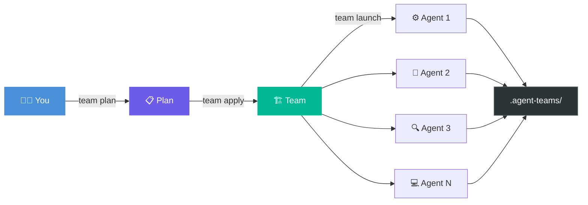

---

## The Problem

You're using one Copilot session for everything — design, code, tests, review — in one long conversation that bleeds context and loses focus. That's like having one person do an entire sprint alone.

Real work is parallel. Real work has specialists. Real work has handoffs.

## The Solution

Describe what you want. Agent Teams spawns a team of Copilot CLI sessions — each in its own terminal tab, each with a dedicated role, each writing to files it owns. No API server. No framework. No dependencies. Just the filesystem.

```powershell
team plan "Build a login page with email/password auth"
```

Three assessors (tech, scope, risk) explore your codebase in parallel. A synthesizer produces a plan with roles, tasks, acceptance criteria, and a feasibility verdict — `go`, `risky`, or `no-go` — before a single token is spent on implementation.

```powershell
team apply       # review the plan, confirm, create the team
team launch login-page
```

Three tabs open. An architect designs the spec. A coder implements from it. A reviewer validates the result. Each wave starts automatically when the previous one finishes.

```powershell
team status login-page
```

```
  ╔══════════════════════════════════════════════╗
  ║  Team: login-page                            ║
  ╚══════════════════════════════════════════════╝

  Scenario: Build a login page with email/password auth
  Project:  C:\Users\dev\my-app

  AGENTS
    🟢 architect — active (task: design, 10s ago)
    🔴 coder — no heartbeat
    🟡 reviewer — idle (2m ago)

  TASKS
    ✅ design → architect [done]
    🔄 implement → coder [in_progress]
    🚫 review → reviewer [blocked] (← implement)

  Progress: 1/3 tasks done
```

Or watch it live:

```powershell
team watch login-page    # auto-refreshes every 3s
```

You don't babysit. You don't copy-paste between windows. You don't manually check which task is next. The orchestrator handles all of it — wave by wave, dependency by dependency — until every task is done.

---

## How It Works (30 seconds)

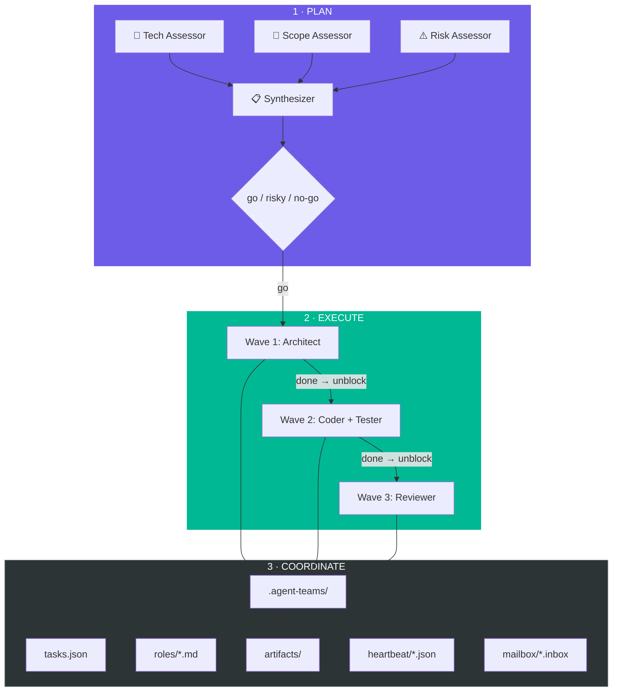

Every agent reads from the same directory. Every agent writes only to files it owns. The filesystem is the shared memory — no server, no API, no message broker. Files in, files out.

---

## Templates

Eleven preset templates across three domains. Pick one, customize it, or let the planner compose a team from scratch.

### 🔧 Engineering

| Template | Agents | Flow | Use Case |
|----------|--------|------|----------|
| **`feature`** | architect, coder, reviewer | design → implement + tests → review | Standard feature development |
| **`fullstack`** | architect, backend, frontend, reviewer | design → backend + frontend → review | Full-stack with API contract |
| **`sprint`** | pm, architect, coder, qa, reviewer | scope → design → implement → QA + review | Full sprint team with PM |
| **`bugfix`** | investigator, fixer, reviewer | investigate → fix → review | Root cause → patch → verify |
| **`refactor`** | explorer, coder, tester, reviewer | explore → implement + test → review | Safe restructuring with coverage |
| **`ship`** | release-manager, qa, reviewer | QA + review → ship | Release coordination |

### 📊 Data Science

| Template | Agents | Flow | Use Case |
|----------|--------|------|----------|
| **`data-science`** | data-engineer, modeler, evaluator, reporter | profile → features → train → evaluate → report | End-to-end ML pipeline |
| **`ml-experiment`** | experimenter ×3, synthesizer | 3 parallel experiments → synthesize | Model comparison (RF vs XGBoost vs NN) |
| **`data-pipeline`** | extractor, transformer, loader, validator | extract → transform → load → validate | ETL workflows |

### 🔍 Operations

| Template | Agents | Flow | Use Case |
|----------|--------|------|----------|
| **`research`** | researcher ×3, synthesizer | 3 parallel investigations → synthesize | Multi-angle analysis |
| **`audit`** | security, perf, quality, synthesizer | 3 parallel audits → synthesize | Code audit with severity ratings |

```powershell
# Engineering
team init auth-flow "Add OAuth2 login flow" feature
team init dashboard "Build analytics dashboard with API" fullstack
team init q4-sprint "Q4 feature: user notifications" sprint
team init flaky-tests "Tests failing intermittently on CI" bugfix
team init api-v2 "Migrate REST endpoints to v2 schema" refactor
team init v2-release "Ship v2.0 to production" ship

# Data Science
team init churn-model "Predict customer churn from usage data" data-science
team init model-bake-off "Compare approaches for sentiment analysis" ml-experiment
team init ingest-pipeline "ETL from S3 to warehouse" data-pipeline

# Operations
team init framework-eval "Evaluate React vs Svelte vs Solid" research
team init soc2-prep "Audit before SOC2 compliance review" audit
```

<details>
<summary><b>📊 Template flow diagrams</b> (click to expand)</summary>

#### feature
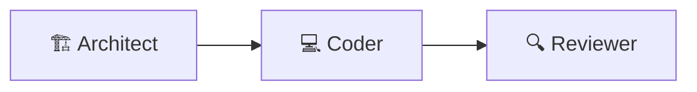

#### fullstack
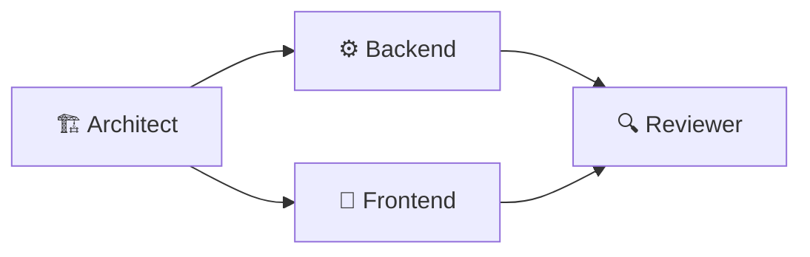

#### sprint
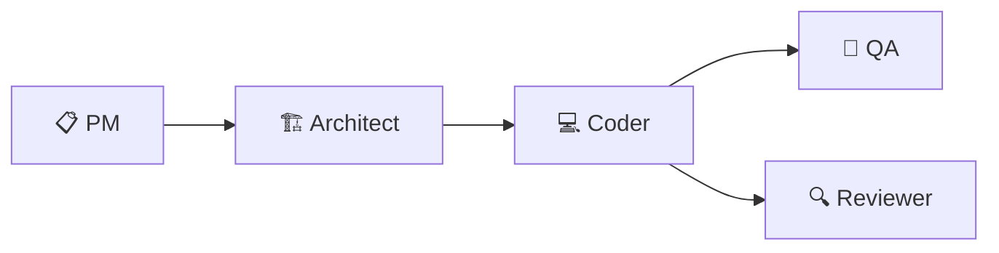

#### bugfix
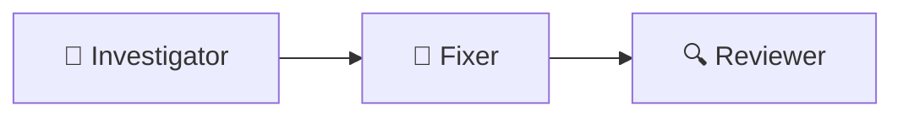

#### refactor
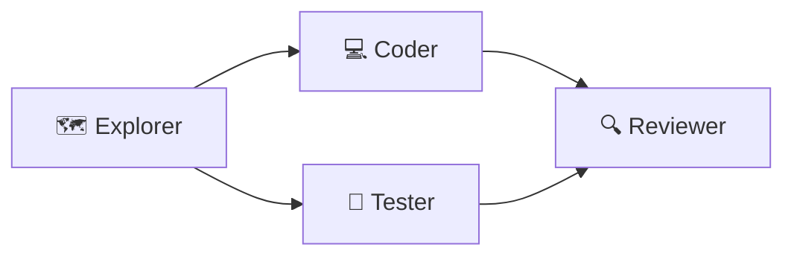

#### ship
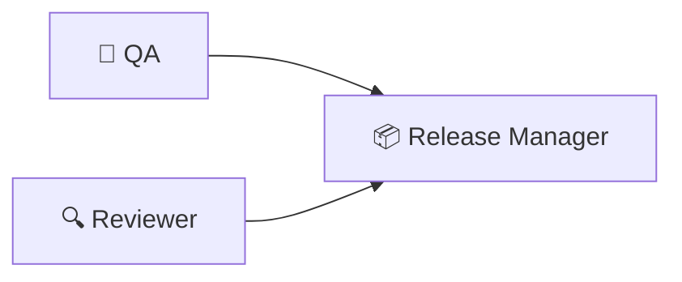

#### data-science
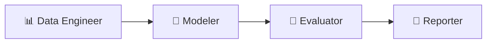

#### ml-experiment
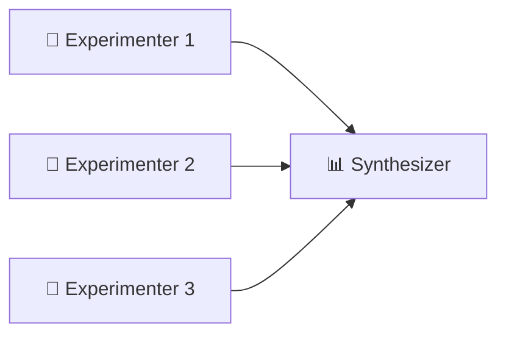

#### data-pipeline
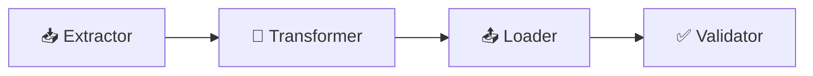

#### audit
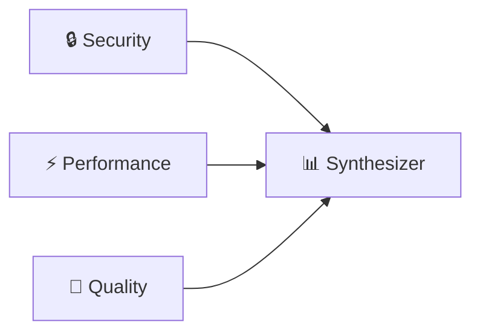

#### research
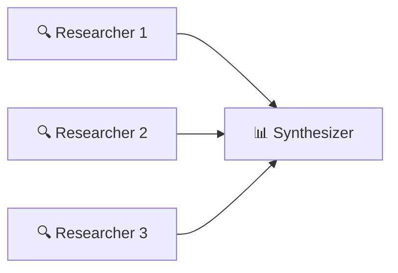

</details>

Templates are JSON files in `templates/presets/`. Create your own or edit the built-ins.

---

## What Makes It Different

| | Agent Teams | Single Copilot Session | Claude Code Agent Teams | CrewAI / LangGraph |
|---|---|---|---|---|
| **Parallelism** | Multiple tabs, real concurrency | One conversation, sequential | Multiple worktrees, parallel | Python processes, parallel |
| **Coordination** | Filesystem (zero infra) | Manual copy-paste | Git branches + worktrees | API server + message queue |
| **Dependencies** | Zero. PowerShell only. | N/A | Claude Code CLI | Python + pip + API keys |
| **Planning** | AI feasibility assessment before execution | You plan manually | Manual team config | Programmatic agent definition |
| **Failure handling** | 3-probe detection + auto-recovery | You notice and fix | Worktree isolation | Framework-dependent |
| **Setup** | `team init` + `team launch` | Open terminal, start typing | Create `.claude/team.yml` | Write Python code |
| **Customization** | Edit Markdown role files | Change your prompt | YAML config | Python classes |

---

## Proven in Production

Real E2E runs, fully autonomous — no human intervention after `team launch`:

**Calculator CLI** — 3 agents, 4 tasks, ~5 minutes. Architect designed the spec, coder implemented TypeScript + tests, reviewer validated. Complete Node.js CLI app from zero.

**Iris ML Pipeline** — 4 agents, 5 tasks. Data engineer profiled the dataset, modeler trained 3 classifiers, evaluator ran precision/recall/F1, reporter generated the executive summary. End-to-end data science from a one-line description.

**Feasibility catches real problems.** The assessment phase flagged ESM/CJS module mismatches and concurrent npm install race conditions — before wasting tokens on implementation that would fail.

---

## Under the Hood

<details>
<summary><b>📁 Coordination Protocol</b></summary>

Every agent reads `protocol.md` on startup. The rules:

1. **Startup sequence:** protocol.md → role file → manifest → tasks.json. Execute in dependency order.
2. **Task completion (crash-safe):** Update tasks.json status → append to mailbox → update heartbeat. Always in this order.
3. **File ownership:** Only write to files listed in your role's `owns_files`. No exceptions.
4. **Mailbox:** Append-only. Never overwrite, never delete. Consistency without locks.
5. **Shared-write files:** tasks.json (your tasks only), mailbox/*.inbox (append-only), heartbeat/{your-key}.json (your heartbeat only).
6. **If blocked:** Set heartbeat to `blocked`, poll tasks.json every 30s, check mailbox for unblock notifications.

Full protocol: [`templates/protocol.md`](templates/protocol.md)

</details>

<details>
<summary><b>📝 Role Files (YAML Frontmatter)</b></summary>

Each role is a Markdown file with YAML frontmatter defining scope, tools, and file ownership. Inspired by [gstack](https://github.com/nichochar/gstack)'s SKILL.md pattern.

```yaml
---
name: Architect
key: architect
description: Designs the API spec
model: claude-sonnet-4
allowed_tools:
  - Read
  - glob
  - grep
  - explore
owns_files:
  - artifacts/design.md
reads_from:
  - tasks.json
  - protocol.md
---

## Instructions
You are the Architect. Explore the codebase,
design the spec, and write it to artifacts/design.md.
```

Each role can also spawn sub-agents (explore, task, general-purpose, code-review) — up to 5 concurrent, max depth 2.

</details>

<details>
<summary><b>🌊 Wave Orchestration</b></summary>

`team launch` runs a wave-based orchestrator:

1. **Scan** — find roles with `pending` tasks (no unmet dependencies)
2. **Spawn** — open a terminal tab per role, all in parallel
3. **Wait** — poll for completion using 3-probe detection
4. **Unblock** — transition `blocked` tasks to `pending` when dependencies are met
5. **Repeat** — spawn the next wave. Continue until all tasks are `done`.

```
Wave 1: [architect]          → design spec
Wave 2: [coder, tester]      → implement + tests (parallel)
Wave 3: [reviewer]           → final review
```

No manual intervention between waves.

</details>

<details>
<summary><b>🔍 3-Probe Failure Detection</b></summary>

An agent might crash, hang, or silently fail. The orchestrator doesn't guess — it checks three independent signals:

1. **`.done` signal file** — written by the launcher script when the Copilot process exits
2. **Task evidence** — did tasks.json actually get updated to `done`?
3. **Heartbeat liveness** — is `heartbeat/{key}.json` still being updated?

If the signal says done but the task isn't updated → evidence-based recovery. If the heartbeat flatlines → the agent crashed. Three probes, three independent signals, one reliable verdict.

</details>

<details>
<summary><b>🛡️ Feasibility Assessment</b></summary>

`team plan` doesn't just plan — it evaluates whether the task is even doable:

1. **Tech Assessor** — scans the codebase for tech stack, dependencies, potential conflicts
2. **Scope Assessor** — evaluates if the task is appropriately sized for the team
3. **Risk Assessor** — identifies blockers, unknowns, and edge cases

All three run in parallel. A synthesizer combines their findings into a verdict:

- **`go`** — clear path forward, proceed
- **`risky`** — concerns flagged, review before proceeding
- **`no-go`** — fundamental blockers identified, don't waste tokens

Each assessor writes to an artifacts file. The synthesizer reads all three and produces `proposed-plan.json`.

</details>

<details>
<summary><b>✅ Acceptance Criteria</b></summary>

Tasks can have acceptance criteria — hard requirements that must be met before a task is considered done.

```json
{
  "id": "implement",
  "title": "Build the login form",
  "assignee": "coder",
  "acceptance_criteria": [
    "Email and password fields with validation",
    "Submit button calls /api/auth/login",
    "Error messages displayed inline",
    "Unit tests for validation logic"
  ]
}
```

Agents are instructed to verify every criterion before marking a task complete. The reviewer validates them in the next wave.

</details>

<details>
<summary><b>📬 Mailbox & Heartbeat</b></summary>

**Mailbox** — append-only message log. Agents never read each other's messages directly; they write to `mailbox/lead.inbox` so the lead can track activity.

```
[2025-07-17T10:32:00Z] architect → lead
Design spec written to artifacts/design.md. Ready for implementation.
---
```

**Heartbeat** — each agent maintains `heartbeat/{key}.json`:

```json
{
  "role": "architect",
  "status": "active",
  "current_task": "design",
  "last_active": "2025-07-17T10:32:00Z"
}
```

The status dashboard reads these: 🟢 active, 🟡 idle, 🔴 unresponsive.

</details>

<details>
<summary><b>🛠️ All Commands</b></summary>

| Command | Description |
|---------|-------------|
| `team plan <scenario> [template-seed]` | AI-generate a team plan (3 assessors → synthesizer) |
| `team apply` | Review and create a team from the proposed plan |
| `team init <name> <scenario> [template]` | Create a team (optionally from a preset template) |
| `team role <name> <key> <desc> [model]` | Add a role manually (generates role file) |
| `team task <name> <id> <title> <role> [deps]` | Add a task (deps: comma-separated task IDs) |
| `team launch <name>` | Orchestrate: spawn waves, wait, unblock, repeat |
| `team launch <name> <role>` | Spawn a single role (manual, non-blocking) |
| `team unblock <name>` | Transition blocked tasks when deps are met |
| `team stop <name>` | Stop all agents and reset tasks |
| `team status <name>` | Dashboard with heartbeats and task progress |
| `team watch <name>` | Live auto-refreshing dashboard (3s interval) |
| `team list` | List all teams |
| `team clean <name>` | Remove a team and its directory |

</details>

---

## Roadmap

```
v0.5 ✅        v0.6           v0.7              v0.8            v0.9            v1.0
current     ─► polish     ─► feedback loops ─► context eng  ─► smart plan  ─► production
                               gen ↔ eval       checkpoints    role library    cross-platform
                               structured       auto-resume    codebase-aware  file locking
                               grading          handoffs       planner         web dashboard
```

**v0.5** (now) — Wave orchestration, 11 templates, 3-probe failure detection, feasibility assessment, 43 unit tests, CI pipeline.

**v0.7** (the big one) — Generator ↔ Evaluator loops. Reviewer creates fix tasks, orchestrator runs another wave. Iterative refinement until quality thresholds pass.

**v0.9** — Smart Planning. Planner composes custom teams from a 30+ role library based on codebase analysis. Templates become shortcuts; roles become atoms.

**v1.0** — Cross-platform. Bun rewrite → single binary for Windows, macOS, Linux. File locking, web dashboard, cost tracking.

Full roadmap: [ROADMAP.md](ROADMAP.md)

---

## Install

```powershell
git clone https://github.com/aviraldua93/agent-teams.git
cd agent-teams
.\install.ps1    # copies to ~/.agent-teams/, adds `team` to your profile
```

Restart your terminal (or `. $PROFILE`).

**Requirements:** [GitHub Copilot CLI](https://docs.github.com/copilot/how-tos/copilot-cli) (`copilot`), [Windows Terminal](https://aka.ms/terminal) (`wt`), PowerShell 7+ (`pwsh`).

---

## Inspired By

- [Claude Code Agent Teams](https://code.claude.com/docs/en/agent-teams) — the concept of coordinated agent sessions
- [gstack](https://github.com/nichochar/gstack) — SKILL.md pattern for role definitions with YAML frontmatter
- [Multi-Agent Playbook](https://github.com/aviraldua93/multi-agent-playbook) — the coordination patterns (docs-as-bus, file ownership, wave ordering)

---

## License

MIT — see [LICENSE](LICENSE) for details.
